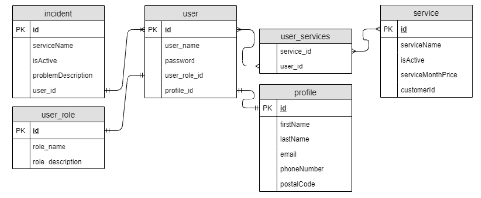
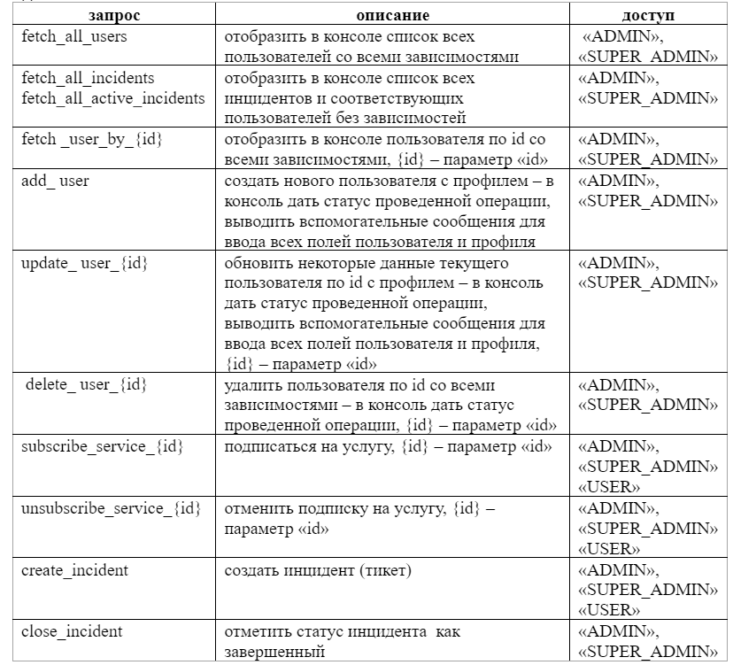

# Web-Service-Customers
#Симулятор службы поддержки клиентов веб-сервиса
1.	Спроектировать БД согласно схеме и реализовать отношения между сущностями (аннотированными классами) с помощью hibernate;

2.	Типы данных в таблицах определить самостоятельно и быть готовым объяснить их применение;
3.	Таблица «user» – пользователь сервиса, в пользователя могут быть роли «USER», «ADMIN», «SUPER_ADMIN» роли должны хранится в таблице «user_role», «profile» – профиль пользователя, «service» – услуги которыми пользуются пользователи, «user_services» – связная таблица для «user» и «service», «incident» – возникший инцидент, поломка сервиса (тикет на который должен ответить тех специалист);
4.	Связи между сущностями hibernate и БД таблицами:
•	один «user» к одному «profile»;
•	один «user» ко многим «incident»;
•	один «user» к одному «user_role»;
•	многие «user» ко многим «service» (каждый пользователь может пользоваться множеством услуг и в тоже время каждая услуга может иметь много подписанных пользователей);
5.	При запуске приложения проводить авторизацию с вводом username и password, приложение ищет в БД, если есть соответствие, то проводим авторизацию пользователя.
6.	Прием запросов можно организовать через консоль, запросы на которые приложение должно отвечать:

